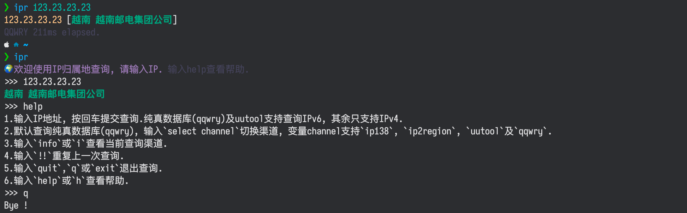

[](https://crates.io/crates/iprr)
[](https://github.com/bujnlc8/ipr/actions/workflows/ipr.yml)

# 查询 IP 归属地

- 支持`IPv4`和`IPv6`

- 支持离线查询

- 支持交互式查询

- 支持多渠道查询

- 支持管道处理



根据我的观察，[纯真数据库(qqwry)](https://update.cz88.net/)和 [IP138](https://ip138.com) 的准确度比较高，默认采用纯真数据库查询

**查询结果仅供参考**

## 用法

```
# 常规查询
ipr [OPTIONS] [IP]

OR

# 进入交互式查询
ipr

OR

# 开启管道查询
echo 1.2.3.4 | ipr

```

如果长时间未响应，可能是由于网络的原因未能成功下载 IP 数据库，可手动点击下面的链接，将下载的文件放在`$HOME/.cache/ipr`目录

- [https://raw.githubusercontent.com/FW27623/qqwry/main/qqwry.dat](https://raw.githubusercontent.com/FW27623/qqwry/main/qqwry.dat)

- [https://raw.githubusercontent.com/lionsoul2014/ip2region/master/data/ip2region.xdb](https://raw.githubusercontent.com/lionsoul2014/ip2region/master/data/ip2region.xdb)

## 下载

- [⬇️ 点击下载 x86_64-apple-darwin](https://github.com/bujnlc8/ipr/releases/download/0.1.5/ipr_x86_64-apple-darwin.tar.gz)

  > [ipr_x86_64-apple-darwin.tar.gz.md5](https://github.com/bujnlc8/ipr/releases/download/0.1.5/ipr_x86_64-apple-darwin.tar.gz.md5)

- [⬇️ 点击下载 aarch64-apple-darwin](https://github.com/bujnlc8/ipr/release/download/0.1.5/ipr_aarch64-apple-darwin.tar.gz)

  > [ipr_aarch64-apple-darwin.tar.gz.md5](https://github.com/bujnlc8/ipr/releases/download/0.1.5/ipr_aarch64-apple-darwin.tar.gz.md5)

- [⬇️ 点击下载 x86_64-unknown-linux-musl](https://github.com/bujnlc8/ipr/release/download/0.1.5/ipr_x86_64-unknown-linux-musl.tar.gz)

  > [ipr_x86_64-unknown-linux-musl.tar.gz.md5](https://github.com/bujnlc8/ipr/releases/download/0.1.5/ipr_x86_64-unknown-linux-musl.tar.gz.md5)

- ~~[⬇️ 点击下载 x86_64-unknown-linux-gnu](https://github.com/bujnlc8/ipr/release/download/0.1.5/ipr_x86_64-unknown-linux-gnu.tar.gz)~~

  > ~~[ipr_x86_64-unknown-linux-gnu.tar.gz.md5](https://github.com/bujnlc8/ipr/releases/download/0.1.5/ipr_x86_64-unknown-linux-gnu.tar.gz.md5)~~

请根据你的操作系统下载相应的版本，可对比 md5 hash 值确定是否下载了最新的版本

解压后运行，在 Macos 中如果出现`"ipr" is damaged and can't beopened.`的提示，请尝试执行以下命令:

```
sudo spctl --master-disable
```

**在 Arm 版的 Mac 上如果仍然打不开，可以尝试 x86 的版本**

## 编译

```
cargo build --release --locked
```

**如果在使用过程中发现 bug，欢迎反馈 👏**
